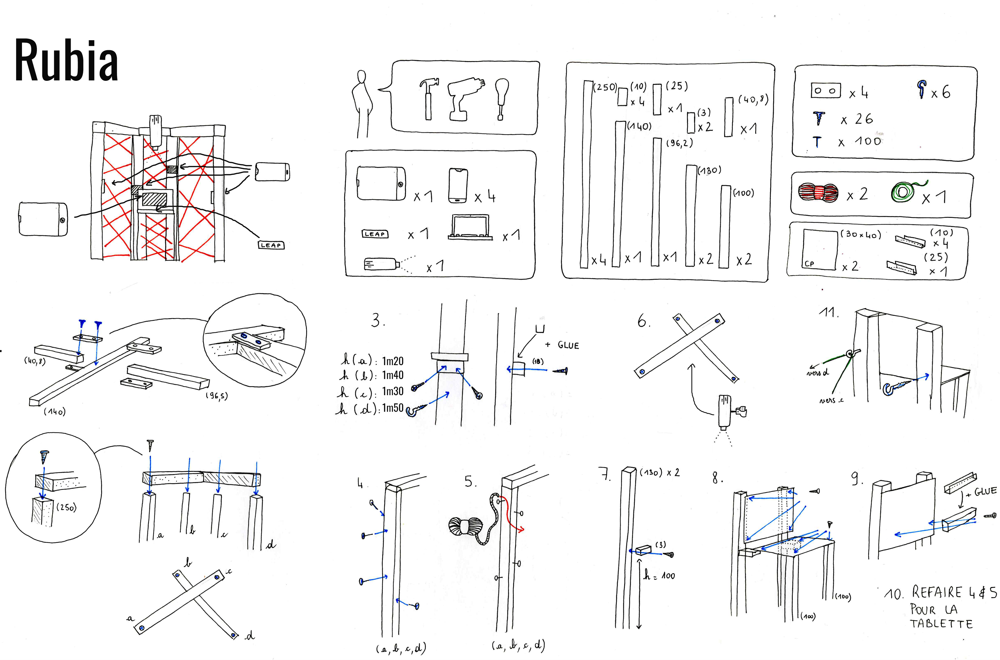

# Tetrakaideca

- Partner : Jardin des Plantes de Nantes

- Students :
    - Simon Bessenay
    - Guillaume Potier
    - Tiphaine Besnard
    - Marion Dallibert
    - Bastien Dauve
    - Theo Denechere


- Input technology : Leap Motion controller

- Output technology : Mobile devices

# Rubia - iCreate project

## Introduction

The goal of this project is to create a structure with a technological activity that shows the internationalization of the Botanical Garden of Nantes, and that uses a Leap Motion controller as an input and mobile devices as outputs. We decided to name our creation **Rubia**.

We propose an introduction video to the user as well as two activites to receive and send seeds all over the world with the interaction of the Leap Motion controller.

## The team

#### École Polytechnique de l'Université de Nantes
Simon Bessenay, Guillaume Potier, Tiphaine Besnard

#### École de Design de Nantes
Marion Dallibert, Bastien Dauve, Theo Denechere

## How to use

#### What is needed

Here is the list of the different devices you need to run the project :
- 4 mobile devices (phone or tablets) with the Firefox web browser
- 1 computer with one of the following Operating System : Windows, Linux or MacOS
- 1 tablet with the Firefox web browser (not necessary but can replace the screen of the computer)

#### General

First, the repository needs to be cloned with the following command on a bash type interpreter :

```bash
git clone https://github.com/Bouhbouh/tetrakaideca.git
```

Then we will need to install all the node packages required for the project by using the following command :

```bash
npm install
```

#### Leap Motion installation

To install the Leap Motion on your desktop, please refer to the [documentation](https://www.leapmotion.com/setup/desktop/) on the official website of the device.

After that, there is two possible configuration :
- If you want to use our program on the same device that the one the leap is connected to, you have nothing to change.
- If you want to connect the Leap Motion on a computer and display our program on a tablet for example, you first need to connect the two device to the same LAN network, then on the device that is connected to the leap, you need to modify the line 28 of *pont.py* to remplace the IP by the one of the device and run it. Then you need to modify *index_leap_motion.html* on line 188 to remplace localhost and the port by the one in the line 28 of *pont.py*. Now you can run *index_leap_motion.html* on any device that is connected to the LAN on the Leap's computer.

#### Setup the environment and have fun

Now that everything is installed we need to setup the environment for the use of the web application. To do so, we first need to be working on a private WiFi and check our IP address with the following command :

```bash
ifconfig
```

This adress will be available under *'inet addr'* on the second line of the *wifi0* part of the result given by the command.

Then, on the 4th line of the *phone_client.js* file under the js directory, replace the *localhost* word by the IP address you just found. Do the same thing on the line number 138 of the *index_leap_motion.html* file.

With that done, we can now start the server :

```bash
node app
```

Now on a Firefox web browser we need to open the master client by typing the following address and port this can be done on the 5th tablet or direclty on the computer by using *localhost* instead of the IP address :

    your_IP_address:8080

After starting the main client, we need the 4 mobile devices with a Firefox web browser available to type the following address :

    your_IP_address:8080/phone

With that open, an alert box will ask an id number on each of the 4 devices. We start from the rightmost with the number 1 and end with the leftmost device with the number 4 and press the *Ok* button. We are now good to go !

#### Important

It's important to note that none of the medias used by the project are available in this Github repository due to their important size. We can provide them if necessary. They are sorted into 3 directories *images, sounds* and *videos*. Those need to be located at the root of the project.

## How to build the structure


